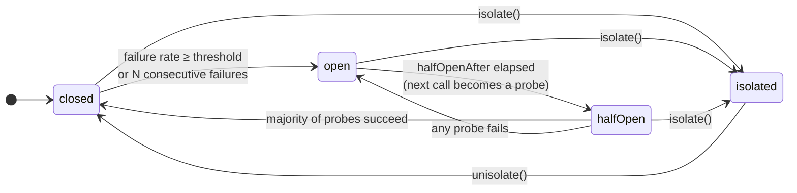

# Circuit breaker

Fails fast while a dependency is down, then probes it and recovers
automatically. While the circuit is **open**, calls are rejected with
[`CircuitOpenError`](errors.md) *without executing the function* — your service
stops burning threads, sockets and latency on a dependency that cannot answer,
and the dependency gets room to breathe.

```ts
import { circuitBreaker } from 'breakwater'

const breaker = circuitBreaker({
  name: 'payments-api',
  failureThreshold: 0.5,   // open at 50% failures...
  minimumCalls: 10,        // ...but only after 10 calls in the window
  halfOpenAfter: 30_000    // probe again 30s after opening
})

const receipt = await breaker.execute(({ signal }) => api.post('/charge', body, { signal }))
```

## The state machine



- **closed** — calls flow; outcomes feed the sliding window.
- **open** — calls reject instantly with `CircuitOpenError` (carrying a
  `stats` snapshot). After `halfOpenAfter`, the next call flips to half-open.
- **half-open** — up to `halfOpenCalls` *concurrent* probe calls are allowed;
  the rest keep rejecting. A **majority** of successes (`floor(n/2) + 1`)
  closes the circuit; **any failure** of the current period reopens it.
- **isolated** — manually opened via `isolate()`; unlike `open`, it never
  expires. Only `unisolate()` leaves it. Calls reject with `IsolatedError`.

## Signature

```ts
circuitBreaker(options?: CircuitBreakerOptions): CircuitBreakerPolicy
```

### Opening policy — pick one of two shapes

**Failure rate over a sliding window** (default, production-grade):

| Option | Type | Default | Description |
|---|---|---|---|
| `failureThreshold` | `number` (0..1] | `0.5` | Failure rate over the window that opens the circuit |
| `window` | `Window` | `timeWindow(30_000)` | `timeWindow(ms)` or `countWindow(n)` |
| `minimumCalls` | `number` | `10` | Never opens before this many calls in the window |

**Consecutive failures** (simple, good for connection-style deps):

| Option | Type | Default | Description |
|---|---|---|---|
| `consecutiveFailures` | `number` | — | Open after N failures in a row; ignores window/threshold |

### Recovery and classification

| Option | Type | Default | Description |
|---|---|---|---|
| `halfOpenAfter` | `number` | `30_000` | Time in ms the circuit stays open before allowing probes |
| `halfOpenCalls` | `number` | `3` | Concurrent probe calls allowed in half-open |
| `failureIf` | `(error) => boolean` | every error | What counts as a failure (below) |
| `name` | `string` | generated | Identifies the breaker in metrics, stats and shared stores |
| `stateStore` | `StateStore` | in-memory | Pluggable state backend (below) |

### `window`: count vs time

```ts
import { countWindow, timeWindow } from 'breakwater'

circuitBreaker({ window: countWindow(100) })   // rate over the last 100 calls
circuitBreaker({ window: timeWindow(60_000) }) // rate over the last 60 seconds
```

Count windows are exact. Time windows use rotating buckets (resilience4j
style): O(1) per call, with the window edge at one-tenth-of-the-window
granularity.

## What counts as a failure?

By default, every error. Two things **never** count (as failure *or* success):

- **Cancellation** — the caller aborting is not the dependency failing.
- **Errors your `failureIf` rejects** — they propagate but leave the stats
  untouched.

```ts
const breaker = circuitBreaker({
  name: 'catalog-api',
  // 4xx means WE sent something wrong — the dependency is healthy.
  failureIf: (error) => !(error instanceof HttpError && error.status < 500)
})
```

## Manual control

```ts
await breaker.isolate()    // force-open: feature flag, maintenance window, kill switch
await breaker.unisolate()  // back to closed with fresh counters

await breaker.reset()      // clear counters and return to closed (e.g. after a reconnect)
                           // reset never leaves `isolated` — that is deliberate

breaker.state              // 'closed' | 'open' | 'half-open' | 'isolated'
breaker.stats()            // snapshot, see below
```

`stats()` is synchronous and answers the 3 a.m. questions:

```ts
{
  state: 'open',
  successes: 3, failures: 17, totalCalls: 20, failureRate: 0.85,
  lastError: FetchError('ECONNREFUSED ...'),
  openedAt: 1783206000000,     // epoch ms
  nextAttemptAt: 1783206030000 // when probing becomes allowed
}
```

`CircuitOpenError` carries the same snapshot in `error.stats` — perfect for a
`Retry-After` header:

```ts
catch (error) {
  if (isCircuitOpenError(error)) {
    const retryAfter = Math.ceil((error.stats.nextAttemptAt! - Date.now()) / 1000)
    return res.set('Retry-After', String(retryAfter)).status(503).end()
  }
}
```

## Events

| Event | Payload | When |
|---|---|---|
| `stateChange` | `{ from, to, stats, correlationId? }` | Every transition |
| `open` / `close` / `halfOpen` | `{ stats, correlationId? }` | The specific transition |
| `reject` | `{ reason: 'circuit_open' \| 'isolated', correlationId }` | Fast rejection without execution |
| `success` | `{ durationMs, correlationId }` | Counted success |
| `failure` | `{ error, durationMs, correlationId }` | Counted failure |

`correlationId` is present when an execution triggered the transition (absent
for manual `isolate()`/`unisolate()`/`reset()`).

## Pluggable state: `StateStore`

The breaker keeps its state behind an interface so it can be shared — the
upcoming Redis store will let N instances of your service agree that an
endpoint is down (only one instance probes it, the rest wait):

```ts
import { memoryStore, countWindow } from 'breakwater'

// Today: share a circuit between two breakers in the same process
const store = memoryStore({ window: countWindow(50) })
const a = circuitBreaker({ name: 'payments', stateStore: store })
const b = circuitBreaker({ name: 'payments', stateStore: store })
```

With a custom store, the store owns the counter aggregation (the breaker's
`window` option is ignored) and a stable `name` is required. Every `StateStore`
method may be sync or async; `transition` must be an atomic compare-and-set.

## Real-world example: HTTP client with per-host breakers

```ts
const breakers = new Map<string, CircuitBreakerPolicy>()

function breakerFor (host: string): CircuitBreakerPolicy {
  let breaker = breakers.get(host)
  if (breaker === undefined) {
    breaker = circuitBreaker({ name: host, failureThreshold: 0.5, minimumCalls: 20 })
    breaker.on('stateChange', ({ from, to, stats }) =>
      log.warn({ host, from, to, failureRate: stats.failureRate }, 'circuit state changed'))
    breakers.set(host, breaker)
  }
  return breaker
}

export async function guardedFetch (url: string, init?: RequestInit): Promise<Response> {
  const { host } = new URL(url)
  return await breakerFor(host).execute(({ signal }) => fetch(url, { ...init, signal }))
}
```

## Synchronous reset: recreate the policy

`reset()`, `isolate()` and `unisolate()` return promises because a state
store may be remote. When a call site cannot await — a constructor, an
event handler, a synchronous API you must preserve — recreate the breaker
instead of resetting it. Creation is cheap and a fresh instance *is* a
clean closed circuit:

```ts
class BrokerClient {
  #breaker = this.#createBreaker()

  #createBreaker () {
    const breaker = circuitBreaker({ name: 'broker', consecutiveFailures: 5 })
    breaker.on('stateChange', (event) => this.onCircuitChange(event))
    return breaker
  }

  // Called synchronously from a reconnection handler: failures accumulated
  // against the previous connection say nothing about the new one.
  resetCircuit () {
    this.#breaker = this.#createBreaker()
  }
}
```

Remember to re-attach listeners in the factory — they belong to the
instance, not the name.

## Gotchas

- **Give the breaker a `name`.** Anonymous breakers get a generated name —
  fine for one-offs, useless in dashboards.
- **`minimumCalls` prevents cold-start flapping**: without it, the first
  failure of the day is a 100% failure rate.
- **Half-open counts per period**: probes still in flight when the circuit
  re-opened belong to the aborted period — their late results are ignored.
- **Pair with `timeout` inside** ([composition](composition.md)): a hung call
  that never settles feeds the breaker nothing; a timeout converts it into a
  countable failure.
