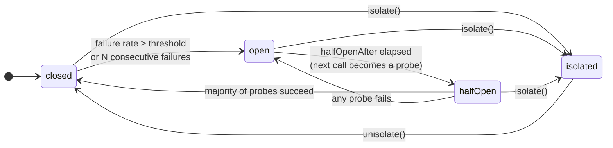

# Circuit breaker

Fails fast while a dependency is down, then probes it and recovers
automatically. While the circuit is **open**, calls are rejected with
[`CircuitOpenError`](errors.md) *without executing the function* — your service
stops burning threads, sockets and latency on a dependency that cannot answer,
and the dependency gets room to breathe.

```ts
import { circuitBreaker } from 'breakwater'

const breaker = circuitBreaker({
  name: 'payments-api',
  failureThreshold: 0.5,   // open at 50% failures...
  minimumCalls: 10,        // ...but only after 10 calls in the window
  halfOpenAfter: 30_000    // probe again 30s after opening
})

const receipt = await breaker.execute(({ signal }) => api.post('/charge', body, { signal }))
```

## The state machine



- **closed** — calls flow; outcomes feed the sliding window.
- **open** — calls reject instantly with `CircuitOpenError` (carrying a
  `stats` snapshot). After `halfOpenAfter`, the next call flips to half-open.
- **half-open** — up to `halfOpenCalls` *concurrent* probe calls are allowed;
  the rest keep rejecting. A **majority** of successes (`floor(n/2) + 1`)
  closes the circuit; **any failure** of the current period reopens it.
- **isolated** — manually opened via `isolate()`; unlike `open`, it never
  expires. Only `unisolate()` leaves it. Calls reject with `IsolatedError`.

## Signature

```ts
circuitBreaker(options?: CircuitBreakerOptions): CircuitBreakerPolicy
```

### Opening policy — pick one of two shapes

**Failure rate over a sliding window** (default, production-grade):

| Option | Type | Default | Description |
|---|---|---|---|
| `failureThreshold` | `number` (0..1] | `0.5` | Failure rate over the window that opens the circuit |
| `window` | `Window` | `timeWindow(30_000)` | `timeWindow(ms)` or `countWindow(n)` |
| `minimumCalls` | `number` | `10` | Never opens before this many calls in the window |

**Consecutive failures** (simple, good for connection-style deps):

| Option | Type | Default | Description |
|---|---|---|---|
| `consecutiveFailures` | `number` | — | Open after N failures in a row; ignores window/threshold |

### Recovery and classification

| Option | Type | Default | Description |
|---|---|---|---|
| `halfOpenAfter` | `number` | `30_000` | Time in ms the circuit stays open before allowing probes |
| `halfOpenCalls` | `number` | `3` | Concurrent probe calls allowed in half-open |
| `failureIf` | `(error) => boolean` | every error | What counts as a failure (below) |
| `name` | `string` | generated | Identifies the breaker in metrics, stats and shared stores |
| `stateStore` | `StateStore` | in-memory | Pluggable state backend (below) |

### `window`: count vs time

```ts
import { countWindow, timeWindow } from 'breakwater'

circuitBreaker({ window: countWindow(100) })   // rate over the last 100 calls
circuitBreaker({ window: timeWindow(60_000) }) // rate over the last 60 seconds
```

Count windows are exact. Time windows use rotating buckets (resilience4j
style): O(1) per call, with the window edge at one-tenth-of-the-window
granularity.

## What counts as a failure?

By default, every error. Two things **never** count (as failure *or* success):

- **Cancellation** — the caller aborting is not the dependency failing.
- **Errors your `failureIf` rejects** — they propagate but leave the stats
  untouched.

```ts
const breaker = circuitBreaker({
  name: 'catalog-api',
  // 4xx means WE sent something wrong — the dependency is healthy.
  failureIf: (error) => !(error instanceof HttpError && error.status < 500)
})
```

## Manual control

```ts
await breaker.isolate()    // force-open: feature flag, maintenance window, kill switch
await breaker.unisolate()  // back to closed with fresh counters

await breaker.reset()      // clear counters and return to closed (e.g. after a reconnect)
                           // reset never leaves `isolated` — that is deliberate

breaker.state              // 'closed' | 'open' | 'half-open' | 'isolated'
breaker.stats()            // snapshot, see below
```

`stats()` is synchronous and answers the 3 a.m. questions:

```ts
{
  state: 'open',
  successes: 3, failures: 17, totalCalls: 20, failureRate: 0.85,
  latency: {                   // over the same window, successes and failures alike
    count: 20,                 // how many durations the numbers are based on
    min: 12, max: 3004, mean: 891,
    p50: 210, p95: 3001, p99: 3004
  },
  lastError: FetchError('ECONNREFUSED ...'),
  openedAt: 1783206000000,     // epoch ms
  nextAttemptAt: 1783206030000 // when probing becomes allowed
}
```

`openedAt` is present while the circuit is `open` or `half-open`, and
`nextAttemptAt` only while `open` — a closed or isolated circuit reports
neither, so a dashboard can never show a countdown on a circuit that is not
counting down.

The latency tells you *which* failure you are looking at: a p95 that jumped to
the timeout while the rate climbed is a dependency slowing down, whereas fast
failures at a healthy p95 are something rejecting you outright.

Two things to know about it. A count window keeps one duration per call, so
`count` matches `totalCalls` exactly; a time window has no call count to bound
it and samples up to 128 durations per bucket, so under heavy traffic the
percentiles come from a subset and `count` says how large it was. And
`latency` is absent from the snapshot inside `CircuitOpenError` — a rejected
call has no latency of its own, and summarising percentiles on every fast
rejection would put real work on the rejection path.

Custom stores opt in by implementing the optional `getLatency` method; one
that does not simply reports no latency.

One sizing note: summarising sorts the window's durations, so `stats()` cost
grows with `countWindow` size. Windows in the hundreds are free; if you
genuinely need hundreds of thousands of calls in the window, prefer
`timeWindow`, which samples a bounded set per bucket.

`CircuitOpenError` carries the counters in `error.stats` — perfect for a
`Retry-After` header:

```ts
catch (error) {
  if (isCircuitOpenError(error)) {
    // nextAttemptAt is present while the circuit is open; a rejection from a
    // saturated half-open period carries no forecast, hence the fallback.
    const untilProbe = (error.stats.nextAttemptAt ?? Date.now()) - Date.now()
    const retryAfter = Math.max(1, Math.ceil(untilProbe / 1000))
    return res.set('Retry-After', String(retryAfter)).status(503).end()
  }
}
```

## Events

| Event | Payload | When |
|---|---|---|
| `stateChange` | `{ from, to, stats, correlationId? }` | Every transition |
| `open` / `close` / `halfOpen` | `{ stats, correlationId? }` | The specific transition |
| `reject` | `{ reason: 'circuit_open' \| 'isolated', correlationId }` | Fast rejection without execution |
| `success` | `{ durationMs, correlationId }` | Counted success |
| `failure` | `{ error, durationMs, correlationId }` | Counted failure |

`correlationId` is present when an execution triggered the transition (absent
for manual `isolate()`/`unisolate()`/`reset()`).

## Pluggable state: `StateStore`

The breaker keeps its state behind an interface so it can be shared.
[`breakwater/redis`](redis.md) lets N instances of your service agree that an
endpoint is down — only one instance probes it, the rest wait:

```ts
import { memoryStore, countWindow } from 'breakwater'

// Today: share a circuit between two breakers in the same process
const store = memoryStore({ window: countWindow(50) })
const a = circuitBreaker({ name: 'payments', stateStore: store })
const b = circuitBreaker({ name: 'payments', stateStore: store })
```

With a custom store, the store owns the counter aggregation (the breaker's
`window` option is ignored) and a stable `name` is required. Every `StateStore`
method may be sync or async — the breaker awaits unconditionally.

### The fenced pair

The circuit is read and moved through exactly two methods, and they are the
reason a shared store can be correct:

```ts
readState(name): StateSnapshot          // { state, fence, openedAt? }
compareAndSet(name, from, to, fence): CasOutcome   // { ok, snapshot }
```

The **fence** is a token the store mints on every successful transition. It
identifies the state *period*, not the state name — `half-open → closed →
open → half-open` ends up spelling "half-open" again, but it is a different
period. `compareAndSet` may swap only if the circuit is still in `from`
**and** nothing has transitioned since the caller read that fence.

That is what makes a decision taken before an `await` unable to land after
the world moved on. A probe that fails, waits on a slow round trip, and only
then tries to reopen the circuit will find its fence stale — and be refused —
instead of killing the recovery period that started meanwhile. There is
deliberately no unfenced shortcut in the interface: a store cannot
accidentally offer a weaker swap than the breaker relies on.

`CasOutcome.snapshot` always says where the circuit is now — the freshly
minted period when `ok`, the period that won the race when not — so losing a
race costs no extra round trip.

The store also owns the period's timing: `openedAt` is stamped when the
circuit enters `open`, carried through `half-open` (the probing belongs to
the same period), and cleared otherwise. That is how N instances agree on
when probing may start. A store that leaves it out still works — each
instance then counts the cooldown from the moment it first *observed* the
open circuit.

The state half of a custom store is about fifteen lines (the counter half —
`recordSuccess`, `recordFailure`, `getCounters`, `resetCounters` and
`acquireProbe` — is whatever your backend makes natural):

```ts
import type { StateSnapshot, StateStore } from 'breakwater'

const state = new Map<string, StateSnapshot>()
const read = (name: string): StateSnapshot => state.get(name) ?? { state: 'closed', fence: 0 }

const stateHalf: Pick<StateStore, 'readState' | 'compareAndSet'> = {
  readState: read,
  compareAndSet (name, from, to, fence) {
    const current = read(name)
    if (current.state !== from || current.fence !== fence) return { ok: false, snapshot: current }
    const next: StateSnapshot = {
      state: to,
      fence: current.fence + 1,
      openedAt: to === 'open' ? Date.now() : to === 'half-open' ? current.openedAt : undefined
    }
    state.set(name, next)
    return { ok: true, snapshot: next }
  }
}
```

### Migrating from `getState` / `transition`

A store written before the fenced pair implemented two methods that no longer
exist:

| Was | Now |
|---|---|
| `getState(name) => BreakerState` | `readState(name) => { state, fence, openedAt? }` |
| `transition(name, from, to) => boolean` | `compareAndSet(name, from, to, fence) => { ok, snapshot }` |

The swap folds the read, the compare and the fence check into one atomic
step, and hands back where the circuit ended up — so a lost race costs no
extra round trip, and a decision taken before an `await` can no longer land
after the circuit moved on. Passing a store that still has the old shape
throws at construction, naming both methods, rather than failing on the first
request in production.

`getLatency` is the one optional method that adds data: implement it to have
durations show up in `stats()`, or leave it out and everything else keeps
working. `delete` is the optional method that removes it: a shared store
keyed by dynamic names (per host, per tenant) accumulates one entry per name
forever unless you call `store.delete(name)` when a name retires — and note
that a breaker created **without** a `name` gets a random one, so never
create anonymous breakers against a shared store.

Errors are contained by role and by moment: while the breaker is *deciding*
an admission (`readState`, `compareAndSet`, `acquireProbe` on the way in) or
serving a manual control call, a store throw propagates — a breaker that
cannot decide must not admit. Once an execution has *settled*, every store
error — bookkeeping writes, counter reads, even the trip/close transitions —
is reported to `console.error` and contained: the caller's outcome is
already decided, and no store failure may rewrite it.

## Real-world example: HTTP client with per-host breakers

```ts
const breakers = new Map<string, CircuitBreakerPolicy>()

function breakerFor (host: string): CircuitBreakerPolicy {
  let breaker = breakers.get(host)
  if (breaker === undefined) {
    breaker = circuitBreaker({ name: host, failureThreshold: 0.5, minimumCalls: 20 })
    breaker.on('stateChange', ({ from, to, stats }) =>
      log.warn({ host, from, to, failureRate: stats.failureRate }, 'circuit state changed'))
    breakers.set(host, breaker)
  }
  return breaker
}

export async function guardedFetch (url: string, init?: RequestInit): Promise<Response> {
  const { host } = new URL(url)
  return await breakerFor(host).execute(({ signal }) => fetch(url, { ...init, signal }))
}
```

## Synchronous reset: recreate the policy

`reset()`, `isolate()` and `unisolate()` return promises because a state
store may be remote. When a call site cannot await — a constructor, an
event handler, a synchronous API you must preserve — recreate the breaker
instead of resetting it. Creation is cheap and a fresh instance *is* a
clean closed circuit:

```ts
class BrokerClient {
  #breaker = this.#createBreaker()

  #createBreaker () {
    const breaker = circuitBreaker({ name: 'broker', consecutiveFailures: 5 })
    breaker.on('stateChange', (event) => this.onCircuitChange(event))
    return breaker
  }

  // Called synchronously from a reconnection handler: failures accumulated
  // against the previous connection say nothing about the new one.
  resetCircuit () {
    this.#breaker = this.#createBreaker()
  }
}
```

Remember to re-attach listeners in the factory — they belong to the
instance, not the name.

## Gotchas

- **Give the breaker a `name`.** Anonymous breakers get a generated name —
  fine for one-offs, useless in dashboards.
- **`minimumCalls` prevents cold-start flapping**: without it, the first
  failure of the day is a 100% failure rate.
- **Half-open counts per period**: probes still in flight when the circuit
  re-opened belong to the aborted period — their late results are ignored.
- **Pair with `timeout` inside** ([composition](composition.md)): a hung call
  that never settles feeds the breaker nothing; a timeout converts it into a
  countable failure.
