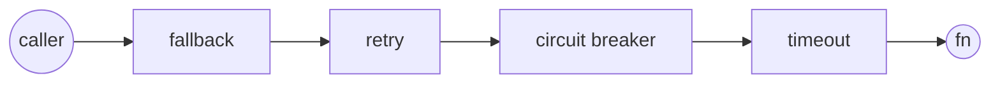
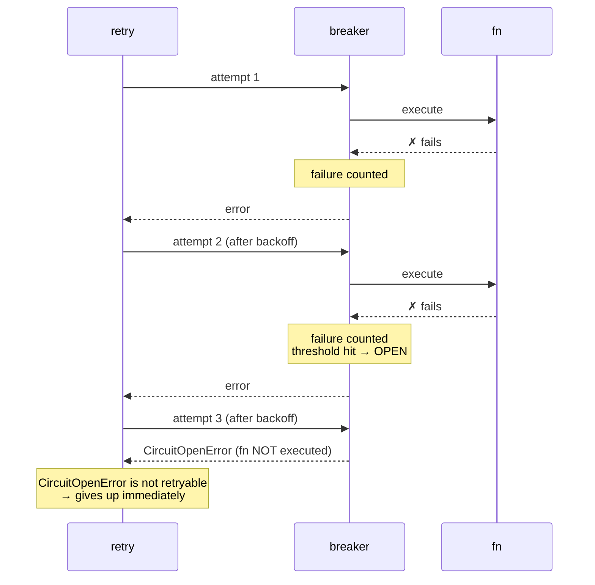
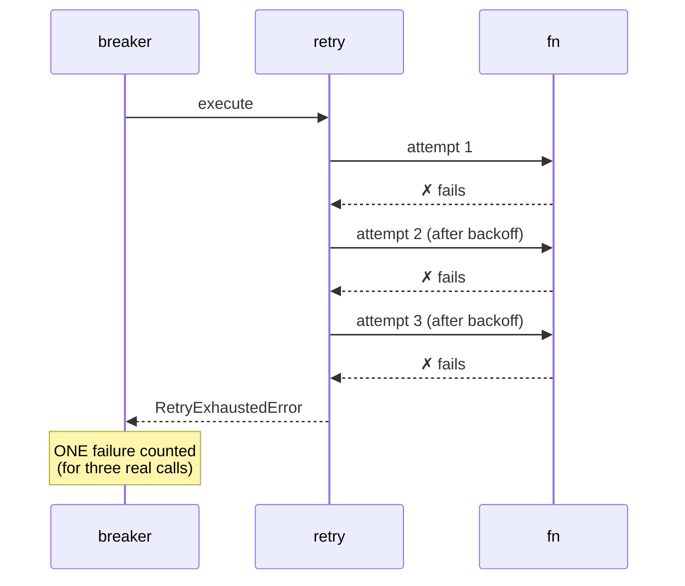

# Composition & ordering

**This is the page that matters.** Individually, retry, timeout, circuit
breaker and fallback are simple. The behavior of your system comes from how
they nest — and the same four policies in two different orders produce two
very different systems. Most libraries leave this undocumented; here it is the
whole point.

## `compose()` — order is the nesting, literally

```ts
import { compose, fallback, retry, circuitBreaker, timeout } from 'breakwater'

const policy = compose(
  fallback(stale),          // ← outermost: runs "around" everything below
  retry({ attempts: 3 }),
  circuitBreaker({ name: 'api' }),
  timeout(2_000)            // ← innermost: hugs the function
)
```

One rule, no exceptions: **`compose(a, b, c)` executes exactly like the nested
calls `a(b(c(fn)))`** — read the argument list left→right as outside→inside.



The result of `compose()` is itself a policy — it has `execute`, `wrap` and
`invoke`, so compositions compose again. It also exposes the composed
`policies` and an aggregated `stats()` (see
[observability](observability.md#aggregated-stats-on-compositions)):

```ts
const inner = compose(circuitBreaker({ name: 'api' }), timeout(2_000))
const outer = compose(retry({ attempts: 3 }), inner) // same as composing all three
```

One `ExecutionContext` (signal, `correlationId`, `metadata`) crosses the whole
pipeline — every event emitted by any policy in the pipeline carries the same
`correlationId`.

## The classic question: retry outside or inside the breaker?

### Option A — retry OUTSIDE the breaker (the default)

```
retry( circuitBreaker( timeout( fn ) ) )
```



What this order means:

- **Every attempt flows through the breaker** and feeds its stats
  individually — the breaker sees the true failure rate of the dependency.
- **When the circuit opens mid-retry, the retry stops immediately**:
  `CircuitOpenError` carries `retryable: false` and the default `retryIf`
  respects it. No sleeping through backoff to hammer an open circuit.
- This is the resilience4j behavior and the least surprising choice —
  **it is what `resilience()` does**.

### Option B — retry INSIDE the breaker

```
circuitBreaker( retry( timeout( fn ) ) )
```



What this order means:

- The breaker sees **one outcome per retry cycle**, not per call: three real
  failures against the dependency count as a single failure. The circuit
  opens much later than the dependency's real state justifies.
- While the retry cycle is running, the breaker cannot cut it short — the
  backoff sleeps happen even if the dependency is clearly down.
- Legitimate use: when you consider "failed after all retries" to be the unit
  of failure worth counting (e.g. a batch job where a cycle is one task).

**Rule of thumb**: protecting a live dependency → Option A. Counting
whole-task outcomes → Option B. When in doubt, A.

## Where does `timeout` go?

**Innermost, almost always.** The timeout bounds *one* execution; retry and
breaker reason about executions.

```
retry( circuitBreaker( timeout( fn ) ) )   ✅ each attempt gets its own 2s budget;
                                              a hung call becomes a countable failure

timeout( retry( fn ) )                     ⚠️ ONE budget for the whole retry cycle —
                                              attempt 2's backoff eats attempt 3's time
```

The second shape is occasionally what you want (a hard SLA on the total
operation) — if so, use **both**: an inner per-attempt timeout and an outer
total deadline via `retry({ deadline })` or an outer `timeout`.

## Where does `fallback` go?

**Outermost.** It rescues everything below it — including `RetryExhaustedError`
and `CircuitOpenError`. If you put it inside retry, the retry will retry your
fallback values (it won't see errors anymore) and `giveUp` never fires.

Caveat with timeout: an *outer* fallback still activates on inner timeouts
(the inner timeout aborts only its own subtree). But `compose(timeout,
fallback, ...)` hands the fallback an already-abortable signal — timeouts
would then look like cancellations and **suppress** the fallback. One more
reason for: fallback outside, timeout inside.

## `resilience()` — the batteries-included order

For the 90% case, skip the decisions:

```ts
import { resilience, exponential } from 'breakwater'

const policy = resilience({
  retry: { attempts: 3, backoff: exponential({ initial: 200 }) },
  rateLimit: { limit: 100, interval: 60_000 },
  bulkhead: { concurrency: 20, queue: 50 },
  circuitBreaker: { name: 'payments-api', failureThreshold: 0.5 },
  timeout: 2_000,                      // number = shortcut for { ms: 2000 }
  fallback: () => ({ queued: true }),  // single handler or a chain
  metrics: collector                   // optional: wires every policy at once
})
```

Fixed, documented order — exactly Option A with fallback outside:

```
fallback( retry( rateLimit( bulkhead( circuitBreaker( timeout( fn ) ) ) ) ) )
```

The local guards sit outside the breaker on purpose: neither a full
[bulkhead](bulkhead.md) nor an exhausted [rate limit](rate-limit.md)
describes the *dependency's* health, so neither may open its circuit — and
both rejections are retryable, letting the outer retry back off through a
burst. The rate limit comes first because its check is the cheapest.

Every option is optional; omitted policies simply drop out of the chain.
`timeout` accepts `{ ms, mode }` for the aggressive mode, and
`fallbackOptions` carries `fallbackIf`. Need a different order? Use
`compose()` — that is why it exists.

## Custom policies compose too

Anything implementing the `Policy` contract (`execute`, `wrap`, `invoke`)
participates in composition. The `invoke(fn, ctx)` method is the composition
primitive — it runs under an *existing* context instead of creating one:

```ts
import { basePolicy, type Policy } from 'breakwater'

function logging (log: Logger): Policy {
  return basePolicy(async (fn, ctx) => {
    const start = performance.now()
    try {
      return await fn(ctx)
    } finally {
      log.debug({ correlationId: ctx.correlationId, ms: performance.now() - start }, 'call finished')
    }
  })
}

const policy = compose(logging(log), retry({ attempts: 3 }), timeout(2_000))
```

Any composed pipeline — custom policies included — can also be registered
under a name and shared across modules: see
[named policies](named-policies.md).
